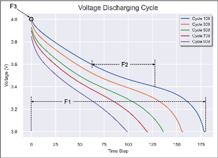
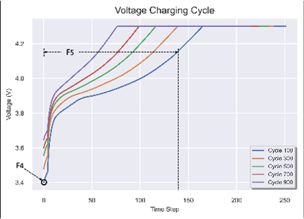
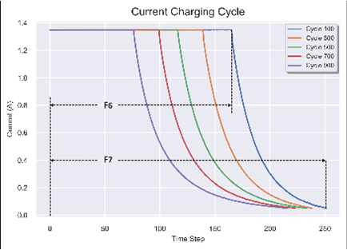

## Motivation

The data used for my model was created by a team of researchers at the Hawaii Natural Energy Institute (HNEI) at the University of Hawaii at Manoa. The team was led by Dr. Scott Dees, who is a professor of mechanical engineering at UH Manoa.The dataset was created to provide a comprehensive and publicly available resource for the development and testing of battery models and control algorithms. The dataset was funded by the U.S. Department of Energy's Office of Energy Efficiency and Renewable Energy (EERE).
 
## Composition
The instances that comprise the HNEI Hawaii Natural Energy Institute NMC-LCO 18650 battery dataset represent measurements from over 1000 NMC-LCO 18650 cells. Each cell was subjected to a variety of cycling and abuse conditions, and the dataset includes cell voltage, current, temperature, and resistance measurements, as well as information on the cell's state of health. There is no missing data in the dataset. The dataset does not contain any data that might be considered confidential. The data was collected from publicly available sources, and it does not include any personal information.The dataset is licensed under the Creative Commons Attribution 4.0 International License.

## Collection process 
The HNEI dataset was collected in experiments conducted between 2013 and 2014. It focused on studying the variability of degradation in Li-ion batteries. The dataset examined 51 NMC-LCO 18650 cells with a nominal capacity of 2.8 Ah, which are commonly used in notebook battery applications.
Initially, the cells underwent conditioning tests where their weights and as-shipped open-circuit voltages (OCV) were measured. Subsequently, several C/2 formation cycles were conducted until the cell capacity stabilized. Following this, each cell went through a reference performance test (RPT) consisting of constant-current cycles. The conditioning tests yielded various cell performance factors, including thermodynamic capacity, capacity ratio, pseudo-OCV curve, internal series resistance, and rate capability.
After the conditioning tests, 15 out of the 51 cells were subjected to 1000 cycles at 25°C with a CC-CV charge rate of C/2 and discharge rate of 1.5C. An RPT was performed after every 100 aging cycles. 

## Preprocessing/cleaning/labelling
The data used in my model was pre-processed to extract features that could be used to predict Remaining useful life in instances where capacity cannot be measured. The feature extraction was conducted by IGNACIO VINUALES who made the data available on Github. The seven features created are shown below
      

ignavinuales, 2022 [online] [Accessed 7 June 2023]. Available from:
https://github.com/ignavinuales/Battery_RUL_Prediction

## Uses
The dataset could be used for these other tasks:
- Developing and testing battery models. 
- Developing and testing battery control algorithms
- Researching battery safety and reliability.
- Developing new battery technologies

The dataset should not be used for these tasks:

Directly using the data to make safety or reliability claims about batteries. The data was collected under controlled conditions and is not representative of all battery use cases. Therefore, it is not appropriate to use the data to make safety or reliability claims about batteries without further analysis and validation.
Using the data to make claims about the performance of specific battery manufacturers or models. The data in the dataset was collected from a variety of sources, and it is not representative of the performance of any specific battery manufacturer or model. As such, it is not appropriate to use the data to make claims about the performance of specific battery manufacturers or models.

## Distribution
The HNEI Hawaii Natural Energy Institute NMC-LCO 18650 battery dataset has already been distributed in a few different ways. It is available for download from the HNEI website, https://www.batteryarchive.org/list.html and github. The dataset is subject to the Creative Commons Attribution 4.0 International License,

## Maintenance
The dataset is maintained by adminstators of the following sites:
Pre-processed data - https://github.com/ignavinuales/Battery_RUL_Prediction
Raw Data - https://www.batteryarchive.org/faq.html

